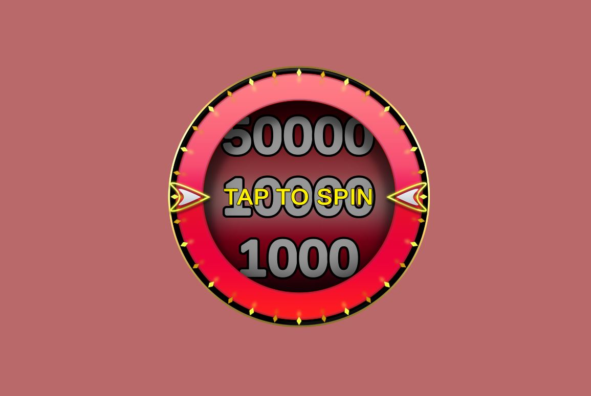
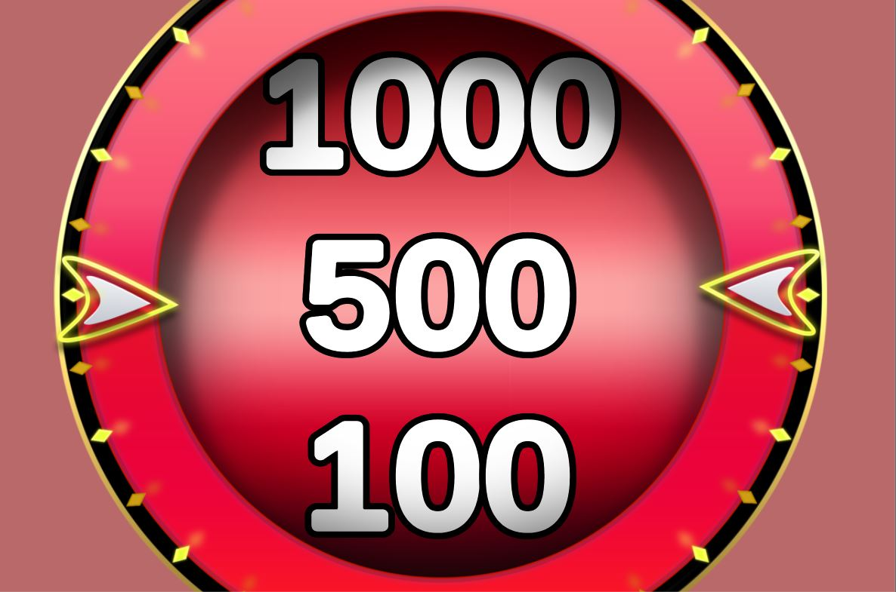
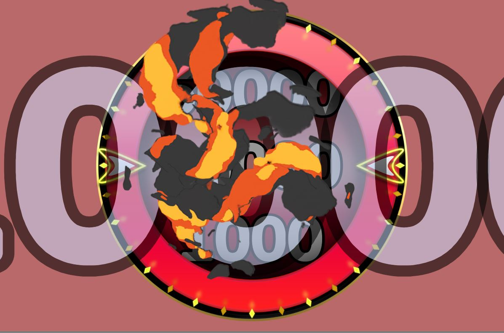
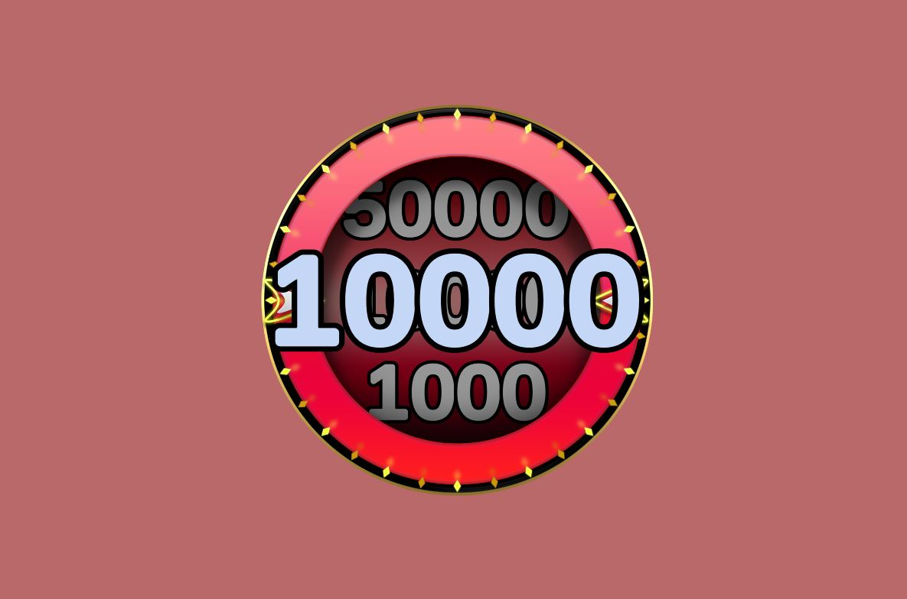

# Spinner Demo

A simple spinner UI application made in Unity3D.

## Screenshots

## Features

- A simple HTTP client.
- Virtual server settings.
  - Allows to simulate of the server's results and delay in seconds
- A powerful Animation system.
  - Each Animation is a scriptable object stored on disk in a .asset file. That way they can be tweaked during play mode without losing their values.
  - Animation Groups contain multiple animations that may be run in parallel or sequentialy.
  - Animation Groups are also animations and therefore can be children of other Animation Groups.

## Libraries used
- [JSON.NET For Unity (Newtonsoft)](https://assetstore.unity.com/packages/tools/input-management/json-net-for-unity-11347)
- [DOTween](https://assetstore.unity.com/packages/tools/animation/dotween-hotween-v2-27676)
- [Explosive Toon VFX Texture](https://assetstore.unity.com/packages/vfx/particles/fire-explosions/explosive-toon-vfx-texture-free-11117)  
